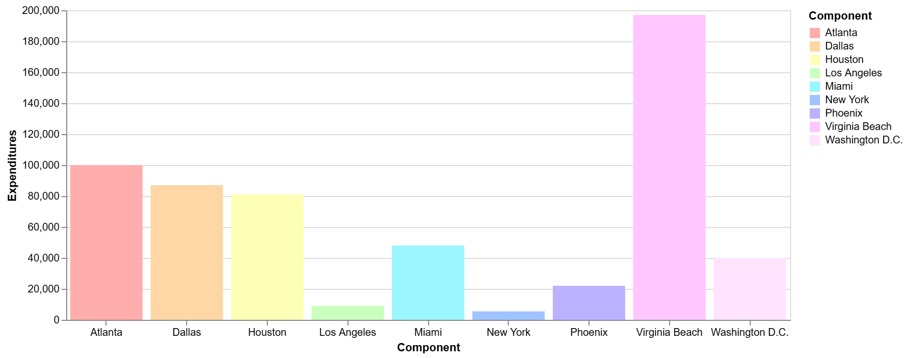

# data-visualization
🗃️ A repository to showcase data visualization projects and conceptual designs

<h2>📊 Bar Chart with Custom Color Palette and Tooltip using <a href="https://vega.github.io/vega-lite/">VegaLite</a> </h2>

<a href="https://vega.github.io/editor/?#/url/vega-lite/N4IgJAzgxgFgpgWwIYgFwhgF0wBwqgegIDc4BzJAOjIEtMYBXAI0poHsDp5kTykBaADZ04JAKyUAVhDYA7EABoQAEzjQATjRyZ289AEEABBBoIcguIaZJ1h2DcyGA7nRiHETOMtXLDypJhUiiAuyvRoAOwADFFK8DRkWGgAzDFK-oFooMRIggxqaADaoADCbGZycLKYaCAAMmwQhvqyZHAWEMEAogAeOFXKdAzqBagAnDFRAL4KpeU4ldW1AHJwToYAmmzqANbdfQNDI52oYmIxM3MVslU16ADqSBAwNK2YcoYAIpQllPv9skGmGGowALJNprMQGVrrdavpMIIkNUUEpegCgSCTgBGCGQq4LG5LdAACTYDAg73kaIOgKOowAHLiLlCYYS4egAAowNhVGg9f6HYHHNAAJlFk0u0PmizuIAAsjQkAgaIK6cKwQzJayZUS5Z9ckjOjSMfSTgzoiyCbLagA1GjqWiyJWGABCcCQsDVmJFqGxY0t0wAujMQMhdrVrOpglUoGxBq0siABahQAAzGjtZS1Nk2pSYACe-VqsnKr1ywSQPRoJ1ASM8ghaZAsaGmoYLSYzWdq6KFWOCheL6AAjgxkTpAjpSCBQ+82IIdDhO5nBNn0L31f380W4LVR+O6AEaNPQ3HBNtl930Lm9cFoLld6mQOpkW0iiAAMRptNIfzZpRfmmygAGxIGIwRfso35MMBEFQEg0FphBYxMGmwHfhBSBRFAoIYQBTDKEwop4Z+35QOhSEAd+cDJBhIZTAxQA">Open in VegaLite</button></a> | <a href="vega-lite/color-customization">View JSON file</button></a>
 
 

<h2>📊 Data Visualization using  <a href="https://powerbi.microsoft.com/en-us/desktop/">Power BI Desktop</a> </h2>

 
 

